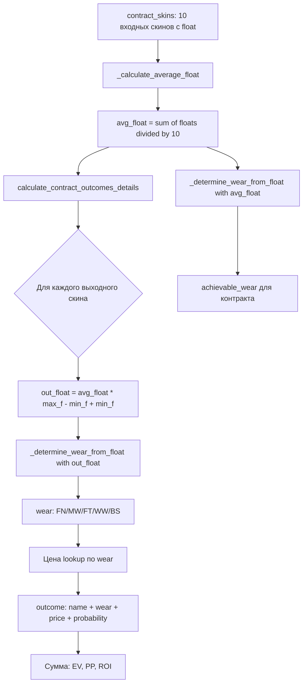

# План: Исправление несовпадения wear выходных скинов с skinsearch

## Диагноз: корневые причины

### Баг 1 (КРИТИЧЕСКИЙ): Нормализация относительно входного скина вместо выходного

**Файл:** [`_calculate_average_normalized_float()`](calculator.py:4647)

Текущая формула:
```
norm_i = (float_i - min_f_INPUT) / (max_f_INPUT - min_f_INPUT)
```

Каждый входной скин нормализуется относительно **своего собственного** `(min_float, max_float)` диапазона.
Это **не соответствует** алгоритму CS2 / skinsearch, где:

```
f' = (avg_float - min_f_TARGET) / (max_f_TARGET - min_f_TARGET)
```

Нормализация должна быть относительно **выходного** скина, а не входного.
Разница критична для скинов с нестандартным `min_float` (например, AK-47 | Redline: min=0.06, max=0.80).

**Пример расхождения:**
- Входной скин с min=0.06, max=0.80, float=0.065
- Наш бот: norm = (0.065 - 0.06) / (0.80 - 0.06) = 0.0068 → avg_norm ≈ 0.007 → wear = FN
- skinsearch: norm = (0.065 - 0.00) / (1.00 - 0.00) = 0.065 → wear = FN
- Но при float=0.075: бот даёт norm=0.020 → FN, а skinsearch даёт 0.075 → MW

### Баг 2 (СРЕДНИЙ): `_determine_best_achievable_wear()` использует avg_norm как абсолютный float

**Файл:** [`_determine_best_achievable_wear()`](calculator.py:4762)

Функция сравнивает `avg_norm` напрямую с порогами 0.07/0.15/0.38/0.45.
Но `avg_norm` — это нормализованное значение [0..1], а пороги — абсолютные float.
Для скинов с `min_float ≠ 0` или `max_float ≠ 1` это даёт неверный результат.

Правильно: сначала денормализовать `avg_norm` обратно в абсолютный float
относительно конкретного выходного скина, затем определять wear.

### Баг 3 (СРЕДНИЙ): `calculate_wear_leap()` использует сырой avg_input_float

**Файл:** [`calculate_wear_leap()`](calculator.py:2892)

Использует `avg_input_float = sum(floats) / len(floats)` — среднее абсолютных float,
без нормализации. Для скинов с нестандартным `min_float` это даёт неверный wear.
Также порог Well-Worn = 0.44 вместо стандартного 0.45.

### Баг 4 (НИЗКИЙ): `_determine_wear_from_float()` — граничные условия

**Файл:** [`_determine_wear_from_float()`](calculator.py:4779) и [`api_client.py`](api_client.py:1012)

Использует строгое `<` для всех порогов. При float **ровно** 0.07 вернёт MW вместо FN.
CS2 использует `<=` для верхней границы wear-диапазона:
- FN: [0.00, 0.07], MW: (0.07, 0.15], FT: (0.15, 0.38], WW: (0.38, 0.45], BS: (0.45, 1.00]

---

## Импакт-анализ

### Затронутые компоненты

| Компонент | Влияние | Кэш/State |
|-----------|---------|-----------|
| [`calculator.py`](calculator.py) — `_calculate_average_normalized_float()` | **Полная замена алгоритма** | Инвалидирует `_memo_contract_eval` и все memo-кэши |
| [`calculator.py`](calculator.py) — `calculate_contract_outcomes_details()` | Пересчёт `out_float` и `wear` для каждого исхода | Инвалидирует `_memo_contract_eval` |
| [`calculator.py`](calculator.py) — `_determine_best_achievable_wear()` | Переписать на денормализацию | Затрагивает `hunt_expected_wear` в результатах |
| [`calculator.py`](calculator.py) — `_calculate_contract_profit()` | Пересчёт `achievable_wear` | Затрагивает `_memo_contract_eval` |
| [`calculator.py`](calculator.py) — `calculate_wear_leap()` | Переписать на нормализованный алгоритм | Нет кэша |
| [`calculator.py`](calculator.py) — `_optimize_contract_floats()` | Пересчёт `limit_avg_norm` | Зависит от `_calculate_average_normalized_float` |
| [`api_client.py`](api_client.py) — `_determine_wear_from_float()` | Граничные условия | Инвалидирует `_prices_cache` |
| [`telegram_bot.py`](telegram_bot.py) — пороги float | Синхронизировать пороги | Нет кэша |
| [`bot_service.py`](bot_service.py) | Косвенное: пересчёт всех контрактов | `_cache` — инвалидация при `clear_price_memoization()` |

### Обратная зависимость по данным

- `_calculate_average_normalized_float()` вызывается из **11 мест** в `calculator.py`
- `_determine_best_achievable_wear()` вызывается из **3 мест**
- `_determine_wear_from_float()` вызывается из **2 мест** в `calculator.py` + `api_client.py`
- Результаты `calculate_contract_outcomes_details()` используются в `telegram_bot.py`, `webapp_server.py`, `bot_service.py`

### Риски

1. **Изменение нормализации → сдвиг всех контрактов**: контракты, которые ранее проходили порог `avg_norm <= 0.07`, могут перестать проходить, и наоборот. Это изменит весь пул рекомендаций.
2. **Инвалидация кэша**: после деплоя первый цикл пересчёта будет медленнее (холодный кэш).
3. **Регрессия `_optimize_contract_floats()`**: этот метод решает оптимизационную задачу с `target_avg_norm`. При изменении semantics `avg_norm` целевая функция может стать некорректной.

---

## Пошаговый план

### Шаг 1: Создать эталонную реализацию нормализации (skinsearch-совместимую)

**Файл:** [`calculator.py`](calculator.py:4647)

**Суть:** Заменить `_calculate_average_normalized_float()` на алгоритм, совместимый с skinsearch:

```
f' = (avg_float - min_f_output) / (max_f_output - min_f_output)
```

Где `avg_float = sum(float_i) / 10` — среднее абсолютных float входных скинов,
а `min_f_output` / `max_f_output` — диапазон **выходного** скина.

**Проблема:** в `_calculate_average_normalized_float()` нет информации о выходном скине.
Нужно изменить сигнатуру: передавать `target_skin_name` или `(min_f, max_f)` выходного скина.

**Подход:** Создать новый метод `_calculate_skinsearch_normalized_float(contract_skins, output_min_float, output_max_float)` и сохранить старый как fallback на время миграции.

**Edge cases:**
- `max_f_output - min_f_output <= 0` (скин с фиксированным float) → вернуть 0.0
- `avg_float < min_f_output` → clamped до 0.0
- `avg_float > max_f_output` → clamped до 1.0
- Выходной скин не найден в БД → fallback на (0.0, 1.0)

---

### Шаг 2: Обновить `calculate_contract_outcomes_details()`

**Файл:** [`calculator.py`](calculator.py:4802)

**Суть:** Для каждого выходного скина вычислять `out_float` по формуле:

```python
avg_float = sum(s.get('float', 0) for s in contract_skins) / 10
out_float = avg_float * (max_f - min_f) + min_f
```

Это **стандартная формула CS2**: `out_float = avg_input_float * (max - min) + min`.

**Текущий код** (строка 4858):
```python
out_float = float(avg_norm) * (max_f - min_f) + min_f
```

Где `avg_norm` — нормализованное значение, вычисленное относительно **входных** скинов.
Это даёт неверный результат, когда входные и выходные скины имеют разные `(min, max)` диапазоны.

**Заменить на:**
```python
avg_float = self._calculate_average_float(contract_skins)
out_float = avg_float * (max_f - min_f) + min_f
```

**Edge cases:**
- `contract_skins` содержит скины с `float=None` — исключить из расчёта, пересчитать делитель
- Все `float=None` — вернуть пустой список outcomes
- `max_f <= min_f + 1e-9` — уже обрабатывается (строка 4855-4856)

---

### Шаг 3: Обновить `_determine_best_achievable_wear()`

**Файл:** [`calculator.py`](calculator.py:4762)

**Суть:** Функция должна принимать абсолютный `avg_float`, а не `avg_norm`.
Либо: убрать функцию и использовать `_determine_wear_from_float(avg_float)` напрямую,
либо: денормализовать `avg_norm` перед сравнением с порогами.

**Рекомендация:** Упростить — заменить тело на вызов `_determine_wear_from_float()`, т.к. после Шага 2 `avg_norm` больше не используется для определения wear.

Но: `_determine_best_achievable_wear()` вызывается с `avg_norm_float` из `_calculate_contract_profit()`.
Нужно передавать туда `avg_float` (абсолютный средний) вместо `avg_norm_float`.

**Изменения в `_calculate_contract_profit()`** (строка 4985):
```python
# Было:
achievable_wear = self._determine_best_achievable_wear(avg_norm_float)
# Стало:
achievable_wear = self._determine_wear_from_float(avg_float)
```

**Edge cases:**
- `avg_float` может быть > 1.0 при нестандартных входных скинах — clamped до 1.0
- `avg_float` может быть < 0.0 — clamped до 0.0

---

### Шаг 4: Исправить граничные условия в `_determine_wear_from_float()`

**Файл:** [`calculator.py`](calculator.py:4779) и [`api_client.py`](api_client.py:1012)

**Суть:** CS2 определяет wear по диапазонам:
- FN: [0.00, 0.07] — включительно с обеих сторон
- MW: (0.07, 0.15]
- FT: (0.15, 0.38]
- WW: (0.38, 0.45]
- BS: (0.45, 1.00]

Текущий код использует `<` (строго меньше), что неверно на границах.

**Заменить:**
```python
# Было:
if f < 0.07: return 'Factory New'
elif f < 0.15: return 'Minimal Wear'
# ...

# Стало:
if f <= 0.07: return 'Factory New'
elif f <= 0.15: return 'Minimal Wear'
elif f <= 0.38: return 'Field-Tested'
elif f <= 0.45: return 'Well-Worn'
else: return 'Battle-Scarred'
```

**Внимание:** Это изменение в `api_client.py` повлияет на wear-метки при парсинге full-export.
Если в full-export приходят лоты с float=0.07, они сейчас помечаются MW, а должны быть FN.
Это может сдвинуть цены для пограничных скинов.

**Edge cases:**
- float = 0.07 ровно → FN (не MW)
- float = 0.15 ровно → MW (не FT)
- float = 1.0 → BS

---

### Шаг 5: Исправить `calculate_wear_leap()`

**Файл:** [`calculator.py`](calculator.py:2892)

**Суть:** Заменить расчёт на нормализованный алгоритм:

1. Вычислить `avg_float = sum(input_floats) / len(input_floats)`
2. Определить wear по абсолютному `avg_float` через `_determine_wear_from_float(avg_float)`
3. Исправить порог WW: 0.44 → 0.45

Также: метод использует `self.price_manager.get_skin_price_with_float()` для получения float входных скинов — это API-вызов. Нужно убедиться, что float уже доступен в `contract_skins` и не требует дополнительного запроса.

**Edge cases:**
- Пустой список `input_skins` → вернуть `{}`
- Все float = None → вернуть `{}`

---

### Шаг 6: Обновить `_optimize_contract_floats()`

**Файл:** [`calculator.py`](calculator.py:2135)

**Суть:** Метод решает оптимизационную задачу: найти самые дешёвые входные скины, у которых `avg_norm <= target_avg_norm`, чтобы выходной wear оставался в целевом диапазоне.

После Шага 2 `avg_norm` меняет semantics. Нужно пересмотреть логику:

**Текущий подход** (строки 2172-2182):
```python
limit_avg_norm = 1.0
for o in outcomes:
    max_norm_for_this = (target_max_avg_norm - min_f) / (max_f - min_f)
    if max_norm_for_this < limit_avg_norm:
        limit_avg_norm = max_norm_for_this
```

Где `target_max_avg_norm` — порог wear (0.07 для FN и т.д.).

**После исправления:** Формула `out_float = avg_float * (max_f - min_f) + min_f` означает:
- Условие `out_float <= threshold` → `avg_float <= (threshold - min_f) / (max_f - min_f)`
- Это **та же** формула, что и сейчас, но `avg_float` теперь — среднее абсолютных float, а не нормализованное значение.

**Изменение:** Заменить `_calculate_average_normalized_float()` на `_calculate_average_float()` внутри `_optimize_contract_floats()`.

**Edge cases:**
- Скин с `max_f = min_f` (фиксированный float) — пропустить
- `target_avg_norm < 0` — clamped до 0

---

### Шаг 7: Синхронизировать пороги в `telegram_bot.py`

**Файл:** [`telegram_bot.py`](telegram_bot.py:580)

**Суть:** Убедиться, что пороги wear в боте совпадают с исправленными в `calculator.py`:
- Проверить `_WEAR_THRESHOLDS` — должны быть `{FN: 0.07, MW: 0.15, FT: 0.38, WW: 0.45, BS: 1.0}`
- Проверить логику `max_out_float_ok` — граничные условия должны использовать `<=` вместо `<`

**Edge cases:**
- `max_allowed_wear == 'Battle-Scarred'` — использовать `max_f` скина, не 1.0

---

### Шаг 8: Инвалидация кэша при деплое

**Файлы:** [`bot_service.py`](bot_service.py), [`api_client.py`](api_client.py)

**Суть:**
1. При изменении `_determine_wear_from_float()` в `api_client.py` все wear-метки в `_prices_cache` становятся некорректными. Нужно обеспечить пересборку кэша при деплое.
2. Добавить версию к кэшу на диске (`market_prices_cache.pkl.gz`): при несовпадении версии — игнорировать кэш и пересобрать.
3. В `bot_service.py` — вызвать `clear_price_memoization()` и сбросить `_cache` при старте после деплоя.

**Edge cases:**
- Дисковый кэш может быть повреждён — уже обрабатывается в `_load_disk_cache()`
- Параллельные запросы во время пересборки — `_prices_cache_lock` уже существует

---

### Шаг 9: Добавить детерминированные тесты

**Файл:** Создать `tests/test_wear_calculation.py`

**Суть:** Изолированные unit-тесты без реальных API-вызовов.

**Тест-кейсы:**

1. **Стандартный скин (min=0.0, max=1.0):**
   - avg_float=0.05 → out_float=0.05 → FN
   - avg_float=0.10 → out_float=0.10 → MW
   - avg_float=0.50 → out_float=0.50 → BS

2. **Нестандартный скин (min=0.06, max=0.80):**
   - avg_float=0.05 → out_float=0.05*0.74+0.06=0.097 → MW
   - avg_float=0.01 → out_float=0.01*0.74+0.06=0.0674 → FN
   - Сравнить с skinsearch для тех же входных данных

3. **Граничные значения float:**
   - float=0.07 ровно → FN (не MW)
   - float=0.15 ровно → MW (не FT)
   - float=0.38 ровно → FT (не WW)
   - float=0.45 ровно → WW (не BS)

4. **Смешанный контракт (разные коллекции):**
   - 7 скинов из коллекции A + 3 из коллекции B
   - Проверить вероятности и wear для каждого исхода

5. **Скин с недоступным wear:**
   - Скин не имеет FN в `wears_avail`
   - out_float=0.05 → wear деградирует до MW

6. **Регрессия: `_optimize_contract_floats()`:**
   - Целевой wear = FN, входные скины с разными float
   - Проверить, что оптимизация не нарушает порог

**Мокирование:**
- `CS2Database` — мок с предустановленными `SkinData` (min/max/wears)
- `PriceManager` — мок с фиксированными ценами
- Без реальных HTTP-вызовов

---

## Диаграмма потока данных (после исправления)



---

## Порядок выполнения

| Шаг | Приоритет | Зависимости | Файлы |
|-----|-----------|-------------|-------|
| 4 | P0 | Нет | `calculator.py`, `api_client.py` |
| 2 | P0 | Нет | `calculator.py` |
| 3 | P0 | Шаг 2 | `calculator.py` |
| 1 | P1 | Шаг 2 | `calculator.py` |
| 6 | P1 | Шаг 2 | `calculator.py` |
| 5 | P2 | Шаг 4 | `calculator.py` |
| 7 | P2 | Шаг 4 | `telegram_bot.py` |
| 8 | P2 | Все | `bot_service.py`, `api_client.py` |
| 9 | P0 | Шаги 2-4 | `tests/test_wear_calculation.py` |

**Рекомендация:** Начать с Шагов 4 → 2 → 3 → 9 (критический путь), затем 1 → 6 → 5 → 7 → 8.
